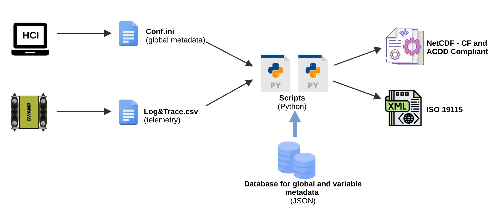

.. FAIR data in marine robotics documentation master file, created by
   sphinx-quickstart on Wed Aug 31 11:25:54 2022.
   You can adapt this file completely to your liking, but it should at least
   contain the root `toctree` directive.

Welcome to FAIR data in marine robotics's documentation!
********************************************************

+------------------------+--------------------------+
| Author                 | Mail                     |
+========================+==========================+
| Corrado Motta          | corradomotta92@gmail.com |
+------------------------+--------------------------+
| Roberta Ferretti       | roberta.ferretti@cnr.it  |
+------------------------+--------------------------+
| Simona Aracri          | simona.aracri@cnr.it     |
+------------------------+--------------------------+

The aim of this documentation is to describe how to make robotic data FAIR (Findable, Accessible, Interoperable, and Reusable) by using a set of tools and scripts defined in python.

See it on GitHub_!

.. _GitHub: https://github.com/CorradoMotta/FAIR-data

======
Status
======

This is a work in progress. At the time of writing, this repository contains several notebooks and python files. Here a short summary of the most important ones:

1. *database.ipynb* : It shows how to create a light database in JSON format. Such database are used to store the standard names of global variables and the standard attributes of robotic and scientific variables. The products of such notebook are stored in the folder ``database`` and are used to fill the NetCDF files with standardized metadata.

2. *netcdf_conventions.ipynb*: It aims to show how to add and possibly extract descriptive and domain specific metadata from NetCDF files using python. It takes raw data in input and creates FAIR NetCDF and ISO-199115-2 files in output. The notebook interacts with the previously created database and with a configuration file that contains the values given to the global metadata. More information are contained directly in the notebook.

3. *nc_gen_script_example.py*: Simple script to generate netcdf files automatically based on the notebook example. It can be used to generate all nc files in once.

4. *fairdata* folder: It contains our own python modules. Right now the only module present is ``metadataDB`` which is the interface towards the JSON databases.

5. *interface* folder: It contains an interface to fill the global metadata and to generate the netcdf files. More information on the dedicated section.

===============
Overall picture
===============

The overall picture is represented in the following schema:

The configuration file can be either created from the interface that control the vehicle or manually, by using the ``conf_template`` file provided in the ``conf`` folder. The telemetry file, in csv format and with two headers, one for the log name and one for the standard name, is created by the vehicle and saved in the vehicle persistent memory. These two files serve as input of our python scripts, which ideally are stored in the same machine where the interface is installed. The python scripts will connect to the light JSON databases using our own module named ``metadataDB`` to collect information about global and variables metadata. Such information are used to generate the final CF and ACDD compliant NetCDF files. A goal of this project is also to generate a ISO-19915 compliant file, which contains solely the metadata. However, this is not completed yet.
 

.. toctree::
   :caption: Contents
   :maxdepth: 2
   
   global_metadata
   variable_metadata
   interface
   Api

Indices and tables
==================

* :ref:`genindex`
* :ref:`modindex`
* :ref:`search`
