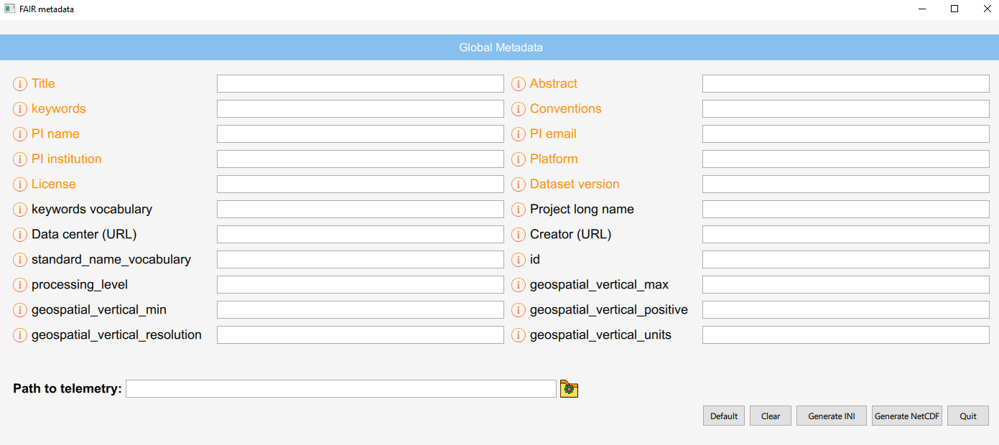

*********
Interface
*********

A simple interface is also provided to fill the global metadata and generated the netcdf files.

The image shows the main view of the interface:

Such interface shows the global metadata (or global attributes in NetCDF). The global metadata are loaded from the JSON database. Therefore, when the JSON database is updated, the interface will show the new values with no need to make changes. Hovering on the information icon will describe the semantic of that specific attributes. The orange attributes are the mandatory ones.

 You can fill the value manually in the input field, or you can click the "default" button to auto fill the fields where a default value is provided. As you can see in the `global metadata list <global_metadata_table.html>`_, some default values already exists. However, you may want to add your custom, nominal default values as well. This can be done in the file default.ini contained in the folder "custom_default". Simply add the ACDD name of the attributes you are interested in, followed by the default value you want. An example is provided here:

.. code-block:: ini

	[default_values]
	title= SWAMP test in Venice
	creator_name="Ferretti Roberta, Bibuli Marco, Motta Corrado"
	creator_email="roberta.ferretti@cnr.it,marco.bibuli@cnr.it,corrado.motta@inm.cnr.it"
	project=INNOVAMARE

Note that if a default value is present both in the JSON database and in this list, the latter will be preferred on the NetCDF generation.

The other buttons are:

1. **Clear**: To reset the values.
2. **Generate INI**: To generate a conf.ini file, in the same folder of the interface, containing the global attributes with the filled values.
3. **Generate NetCDF**: Will generate the NetCDF file, by using the script named ``nc_gen_script``. The path is taken from the input field on the left. The path can be a specific CSV file or a folder contaning several CSV files. The only supported format is CSV with comma as separator. But this can be easiliy changed in the python code.
4. **Quit**: To Quit the interface

All python and QML files and methods are documented and easy to modified. To run the interface, simply open a terminale with your anaconda environment activated, navigate to the "interface" folder and run:

:code:`$ python main.py`