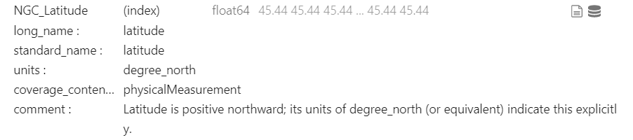

*****************
Variable Metadata
*****************

Check the <a class="reference external" href="variable_metadata_table.html">list</a>.
We are currently working on identifying the correct names and attributes for our robotic and scientific variables following, when possible, the existing standards. We decided on a minimum set of attributes for each variable. Such attributes are taken from ACDD and CF conventions. The attributes should be:

1. **long_name**: in case a standard_name is not found on CF convention, the long_name will assume that role. Otherwise standard_name and long_name coincide.
2. **standard_name**: Standard name following CF table_.
3. **units**: A character string that specifies the units used for the variable's data (empty if dimensionless).
4. **coverage_content_type**: An ISO 19115-1 code to indicate the source of the data e.g., physicalMeasurement, auxiliaryInformation, or modelResult).
5. **comments**: Miscellaneous information about the data or methods used to produce it. This is especially important for the variables that do not have a standard_name. Can be omitted in the other case.

.. _table: https://cfconventions.org/Data/cf-standard-names/current/build/cf-standard-name-table.html

Considering that in the telemetry of a robotic vehicle the same variable can be measured by two or more different sensors (e.g., GPS position given by 3, 4 different GPS on board), we need to be able to give a **custom** name to each variable in the log, but also a **pointer** to the standard variable. In that way, the log can be automatically used to generate a NetCDF4 FAIR-compliant file, where besides the global metadata, each variable contains all needed attributes to be found and understood both by machine and humans.

Therefore, the idea is to create a light JSON database that contains all of our robotic and scientific variables, comprising the attributes mentioned above. Each variable in the database is saved with a unique ID and also with a unique field, the long_name.

The log file should then contains **two lines** for the the header like in the following example:

::

	NGC_latitude, NGC_longitude, MBES_latitude, MBES_longitude
	latitude, longitude, latitude, longitude
	45.438759, 12.327145, 45.515624, 12.419372
	45.438760, 12.327148, 45.515635, 12.419332
	45.438750, 12.327103, 45.515690, 12.419345

As we can see the first header line contains the custom name. The second one contains the long_name of the standard variable that it refers to. The two different latitudes refer to the same long_name as well as the two longitudes. When the NetCDF notebook of this repository is launched, it reads the header of the log files, get the long_names, open the JSON database and find the correspondent attributes for that specific variable. In this case, the database looks as simple as the following JSON snippet:

.. code-block:: json

	"194752233979849288": {
		"long_name": "latitude",
		"standard_name": "latitude",
		"units": "degree_north",
		"coverage_content_type": "physicalMeasurement",
		"comment": "Latitude is positive northward; its units of degree_north (or equivalent) indicate this explicitly.",
		"version": "1.0"
	},
	"159308534919354804": {
		"long_name": "longitude",
		"standard_name": "longitude",
		"units": "degree_east",
		"coverage_content_type": "physicalMeasurement",
		"comment": "Longitude is positive eastward; its units of degree_east (or equivalent) indicate this explicitly.",
		"version": "1.0"
	}
	
By retrieving the attributes using the ID, it can then fill the NETCDF and makes it FAIR-compliant. When the NetCDF is open, the variable will be visualized as follow:

